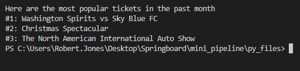

# Most Popular Events (Mini Data Pipeline)
Create a data pipeline using Python to assist with the sale of tickets. 
Use Python database connector to perform data loading and to query the database programmatically.
### Software 
MySQL 8.0
Python 3
VS Code
## Local Execution 
<strong>Create Table and Insert Data</strong>

   

 
<strong>Print Table to View</strong>

 
<strong>Print Results</strong>

    

## Findings
Here are the most popular tickets in the past month  
#1: Washington Spirits vs Sky Blue FC  
#2: Christmas Spectacular  
#3: The North American International Auto Show  
